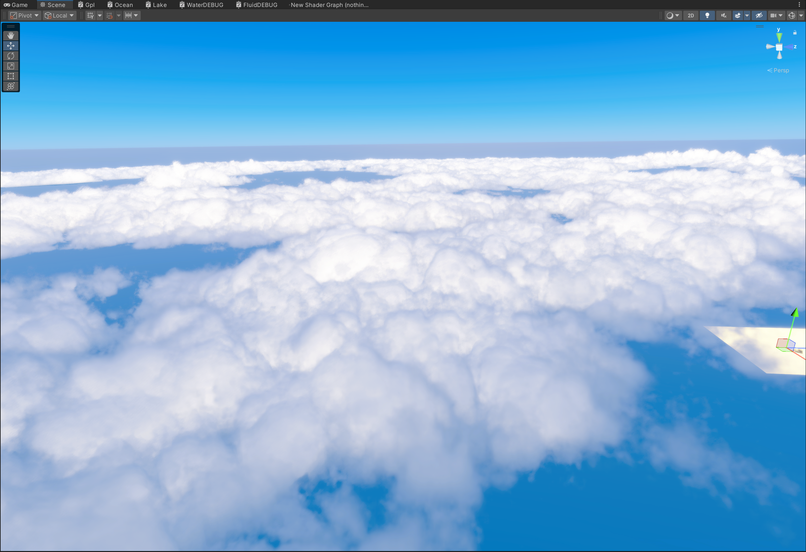
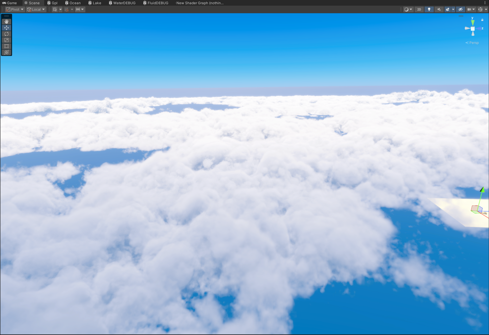
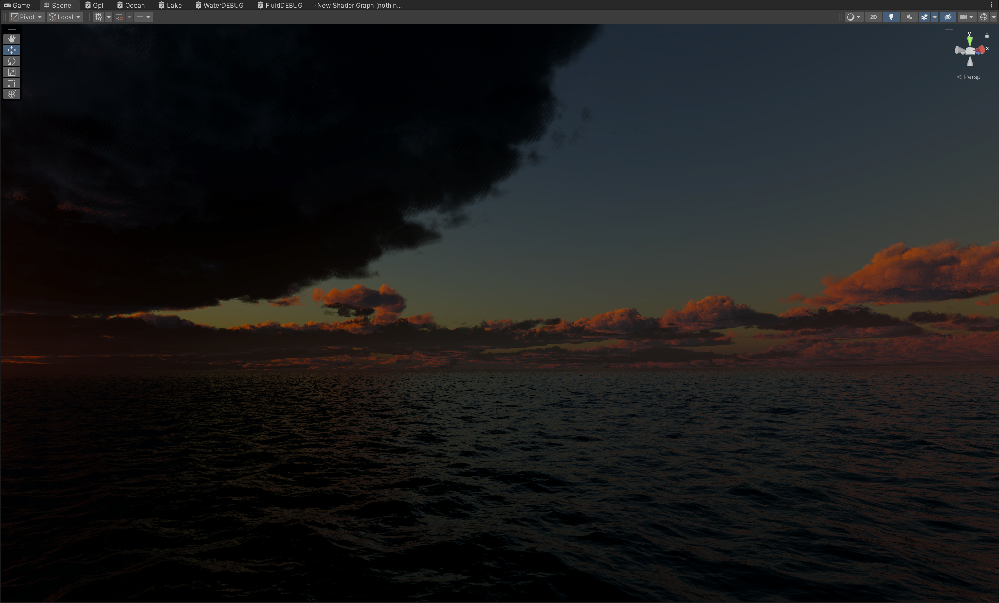

# HanPi Volume Cloud System

HDRP 体积云渲染系统。本文档重点介绍 **phi_fwd 物理漫射场**——用于模拟厚云中**各向同性多重散射**的加性光照项。

> 完整物理推导见：[Docs/PhiFwd_FromRTE.md](Docs/PhiFwd_FromRTE.md)

> ## Third-Party Notice

Portions of this work are derived from Unity High Definition Render Pipeline (HDRP),
subject to Unity's license terms. HanPi modifications are licensed under MIT as
stated above. Users are responsible for complying with Unity Editor / HDRP license
when using this code in Unity projects.

---

## 效果对比

**添加各向同性多重散射**


**无**


**添加各向同性多重散射**



**无**




**添加各向同性多重散射**


**无**


**添加各向同性多重散射**


**无**


**添加各向同性多重散射**


**无**



---

## 为什么需要 phi_fwd？

体积云的光照本质是求解**辐射传输方程（RTE）**。单次散射（如 Henyey–Greenstein 相位函数）方向性很强，光子沿太阳方向一次穿透后即衰减，导致：

| 仅单次散射 | 真实厚云（含多重散射） |
|---|---|
| 云内部随光学深度指数变暗 | 光学深度 τ > 1 后亮度趋于**饱和** |
| 云底、侧面接近全黑 | 云底与侧面有可见的**漫射发光** |
| 强前向散射，方向记忆明显 | 多次弹射后散射越来越**各向同性** |

**phi_fwd** 专门建模上述「多重散射后的各向同性漫射场」——不是替代 Hillaire 风格的方向性太阳散射，而是作为**物理补充的加性独立项**，让厚积云、层积云更接近高反照率水云的真实外观。

---

## phi_fwd 实现的云特征

在光学厚度 τ ≫ 1 的扩散 regime 下，光子在云内经历大量散射、方向记忆消失，有效各向异性 g_eff → 0。phi_fwd 正是针对这一物理状态，在渲染中体现为：

### 1. 厚云内部的均匀照明（饱和而非指数衰减）

高反照率水云（ω₀ ≈ 0.999）中，光子被散射后几乎不被吸收，在体积内随机游走。漫射场以**慢衰减尺度**传播（`exp(−∫κ ds)`，κ 远小于单次散射的 Beer–Lambert 尺度），使云芯在 τ = 20 时仍保留约 33% 的漫射能量——内部不再「越往里越黑」。

### 2. 云底与侧面的可见发光

单次散射模型下，背光侧与云底缺乏能量注入。phi_fwd 沿太阳方向累积**有效扩散源**，再经格林函数核传播到观测点，使云底、侧面出现符合物理直觉的**灰白漫射光**，而非死黑剪影。

### 3. 各向同性多重散射（与方向性散射分工）

- **方向性散射**（HG 等）：保留单次/少次散射的前向瓣，负责边缘高光与太阳方向感。
- **phi_fwd 漫射场**：假设 g_eff = 0，用标量辐照度 φ(x) 近似多重散射后的**各向同性**能量分布。

两者叠加：外层有方向性，内部与底面由各向同性漫射场「填满」。

### 4. 边界受光与背光抑制

背光/逃逸边界不应与受光边界同等注入扩散源。phi_fwd 引入**边界受光置信度**（基于 2D 高度差分法线与太阳方向的 wrap 光照），避免背光侧被错误打亮，同时保留受光边界附近的可信漫射注入。

### 5. 稀薄边缘的门控

扩散近似仅适用于 τ ≫ 1。低密度、薄雾区域通过**密度门控**缩短有效散射积分，避免边缘不满足物理假设时仍贡献完整各向同性散射。

---

## 物理链路（概要）

```
RTE（辐射传输方程）
  → 扩散近似（τ ≫ 1，g_eff → 0，各向同性）
    → Helmholtz 型 + 格林函数 G(x,x') = exp(−κr) / (4πr)
      → 有效源项 Q_eff（慢衰减 + 局部散射沉积 + 边界置信度）
        → 沿太阳方向 1D 离散 → phi_fwd
```

---

---

## 许可与署名

本项目采用 [MIT License](LICENSE)，并附加 **署名要求（Additional Attribution Requirement）**。


**推荐署名格式：**

> HanPi Volume Cloud © [AshenOneArt](https://github.com/AshenOneArt)  
> https://github.com/AshenOneArt/HPVolumeCloud

分发时须同时保留 `LICENSE` 中的版权声明与许可全文。

